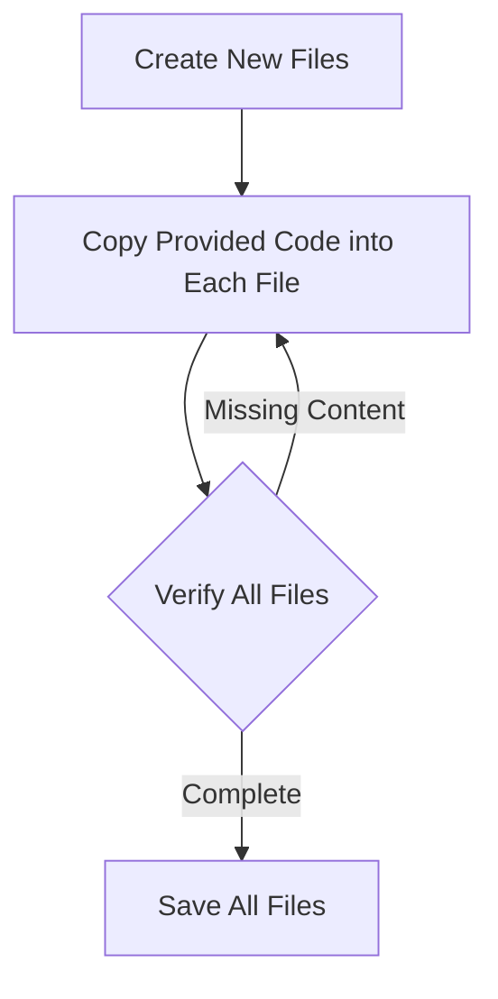

# Library Management System

<div align="center">
  
  <p><em>A Qt-based C++ Library Management Application</em></p>
</div>

## Project Overview
The Library Management System is a C++ application built with Qt that provides a comprehensive solution for managing library resources. This console-based application allows librarians and users to manage books and magazines, including adding new items, searching the catalog, and handling the borrowing and returning process.

## Features

- **📚 Item Management**: Add books and magazines to the library catalog
- **🔍 Search Functionality**: Search for items by title, author, or ID
- **🔄 Borrowing System**: Track the availability of items and manage the borrowing/returning process
- **💾 Data Persistence**: Save library data to files for persistent storage across sessions
- **🖥️ Console Interface**: User-friendly menu-driven interface for all operations

## System Architecture

### Class Structure

```
┌───────────────────┐
│   LibraryItem     │
│   (Base Class)    │
└─────────┬─────────┘
          │
          ├─────────────────┐
          │                 │
┌─────────▼──────┐  ┌───────▼───────┐
│     Book       │  │    Magazine   │
│ (Derived Class)│  │(Derived Class)│
└────────────────┘  └───────────────┘
          │                 │
          └────────┬────────┘
                   │
          ┌────────▼────────┐
          │ LibraryManager  │
          └─────────────────┘
```

## Setup Instructions

### Prerequisites

<table>
  <tr>
    <td><b>Software</b></td>
    <td><b>Version</b></td>
    <td><b>Purpose</b></td>
  </tr>
  <tr>
    <td>Qt Creator</td>
    <td>5.12 or higher</td>
    <td>IDE for development</td>
  </tr>
  <tr>
    <td>C++ Compiler</td>
    <td>C++11 support</td>
    <td>Code compilation</td>
  </tr>
  <tr>
    <td>Qt Libraries</td>
    <td>5.12 or higher</td>
    <td>Required dependencies</td>
  </tr>
</table>

### Step 1: Install Qt Creator

1. Download Qt Creator from the [official Qt website](https://www.qt.io/download)
2. Follow the installation instructions for your operating system
3. Make sure to include the Qt development libraries during installation

### Step 2: Set Up the Project

<details>
  <summary>Expand for detailed steps</summary>
  
  1. Open Qt Creator
  2. Go to File > New File or Project
  3. Select "Qt Console Application" and click "Choose..."
  4. Name your project (e.g., "LibraryManagementSystem") and set the location
  5. Follow the wizard, selecting your preferred kit
  6. Click "Finish" to create the project
</details>

### Step 3: Add Source Files

<table>
  <tr>
    <td><b>File Name</b></td>
    <td><b>Description</b></td>
  </tr>
  <tr>
    <td>libraryitem.h</td>
    <td>Header for base class</td>
  </tr>
  <tr>
    <td>libraryitem.cpp</td>
    <td>Implementation of base class</td>
  </tr>
  <tr>
    <td>book.h</td>
    <td>Header for Book class</td>
  </tr>
  <tr>
    <td>book.cpp</td>
    <td>Implementation of Book class</td>
  </tr>
  <tr>
    <td>magazine.h</td>
    <td>Header for Magazine class</td>
  </tr>
  <tr>
    <td>magazine.cpp</td>
    <td>Implementation of Magazine class</td>
  </tr>
  <tr>
    <td>librarymanager.h</td>
    <td>Header for Library Manager</td>
  </tr>
  <tr>
    <td>librarymanager.cpp</td>
    <td>Implementation of Library Manager</td>
  </tr>
  <tr>
    <td>main.cpp</td>
    <td>Main application entry point</td>
  </tr>
</table>

### Step 4: Copy Code



Make sure to copy the code from each provided file into the respective files in your project.

### Step 5: Configure Data Directory

⚠️ **Important**: Fix the hardcoded file path in main.cpp:

```cpp
// Change this:
QString sDataFilePath = QDir::current().absoluteFilePath("C:\\data\\library_data.txt");

// To this (preferred, platform-independent):
QString sDataFilePath = QDir::current().absoluteFilePath("library_data.txt");
```

Alternatively, create the directory structure:

```cpp
// Create directory if it doesn't exist:
QDir().mkpath("data");
QString sDataFilePath = QDir::current().absoluteFilePath("data/library_data.txt");
```

### Step 6: Build and Run

1. Click "Build" > "Build Project" (or press <kbd>Ctrl</kbd>+<kbd>B</kbd>)
2. After successful build, click "Build" > "Run" (or press <kbd>Ctrl</kbd>+<kbd>R</kbd>)

## Usage Guide

### Main Menu Options

```
Library Management System
-------------------------
1. Add a new book
2. Add a new magazine
3. Search by title
4. Search by author
5. Search by ID
6. Borrow an item
7. Return an item
8. Display all items
0. Exit
-------------------------
Enter your choice:
```

### Workflow Examples

<details>
  <summary><b>Adding a New Book</b></summary>
  
  1. Select option `1` from the main menu
  2. Enter the book title when prompted
  3. Enter the author's name
  4. Enter the book genre
  5. The system will confirm the book has been added
</details>

<details>
  <summary><b>Borrowing an Item</b></summary>
  
  1. Find the item ID (using search or display all)
  2. Select option `6` from the main menu
  3. Enter the ID of the item to borrow
  4. The system will confirm if borrowing was successful or notify if the item is already borrowed
</details>

<details>
  <summary><b>Searching the Catalog</b></summary>
  
  1. Choose a search option (`3`, `4`, or `5`)
  2. Enter the search term as prompted
  3. View the list of matching items
  4. Press Enter to return to the main menu
</details>

### Data Storage Format

The library data is stored in a fixed-width text format:

```
ID    TYPE       TITLE                         AUTHOR                    AVAILABILITY       ISSUE/GENRE
1     Book       Programming in C++            Bjarne Stroustrup         Available          Computer Science
2     Magazine   National Geographic           Nat Geo Society           Rented             142
3     Book       The Lord of the Rings         J.R.R. Tolkien            Available          Fantasy
```

Field structure:
- Item ID (5 characters)
- Type (10 characters)
- Title (30 characters)
- Author/Publisher (25 characters)
- Availability status (20 characters)
- Additional attributes - Genre or Issue Number (variable length)

## Troubleshooting

### Common Issues

<table>
  <tr>
    <th>Issue</th>
    <th>Possible Cause</th>
    <th>Solution</th>
  </tr>
  <tr>
    <td>File not found errors</td>
    <td>Invalid data file path</td>
    <td>
      - Check if specified directory exists<br>
      - Ensure write permissions for the data directory<br>
      - Try using a relative path
    </td>
  </tr>
  <tr>
    <td>Build errors</td>
    <td>Missing or misconfigured dependencies</td>
    <td>
      - Verify Qt libraries are properly installed<br>
      - Check that all files are correctly added to the project<br>
      - Confirm code is copied without missing sections
    </td>
  </tr>
  <tr>
    <td>Runtime errors with Magazine parsing</td>
    <td>Regular expression error</td>
    <td>
      Fix the regular expression in librarymanager.cpp:<br>
      <code>QRegularExpression re("(\\d+");</code><br>
      should be:<br>
      <code>QRegularExpression re("(\\d+)");</code>
    </td>
  </tr>
</table>

## Extending the System

### Potential Enhancements

<div align="center">
  
</div>

To extend this system, consider implementing:

- 📱 **GUI Interface**: Create a graphical interface using Qt widgets
- 👤 **User Management**: Add user accounts and authentication
- ⏰ **Due Dates & Fines**: Implement borrowing time limits and late fees
- 📊 **Statistics & Reports**: Generate usage reports and analytics
- 📲 **Mobile App**: Develop companion mobile applications
- 🔒 **Security Features**: Add encryption and access control

## Credits

Developed as a C++ Qt project demonstrating object-oriented programming principles, including inheritance, polymorphism, and encapsulation.

<div align="center">
  <hr>
  <p>
    <b>Library Management System</b><br>
    A Qt C++ Implementation
  </p>
</div>

## License

This project is provided for educational purposes. Feel free to use and modify as needed.

---

<div align="center">
  <p>
    <a href="#library-management-system">Back to Top ⬆️</a>
  </p>
</div>
